## BIKIN REPOSITORY BARU BIAR GAMPANG MAS GA GANTI" FILE HEHE

Nama : Mochamad Gilang Fadil Hakim

NIM : H1D022082

Shift Baru: B

Penjelasan source code 

1. Fitur Registrasi

    RegistrasiPage: Halaman registrasi memiliki beberapa komponen utama yang terdiri dari tiga TextEditingController untuk mengelola input pada TextField (nama, email, password), dan sebuah tombol submit berbasis ElevatedButton. Komponen ini berada dalam Form yang memanfaatkan kunci global (_formKey) untuk validasi input.

    Kode penting:
        _namaTextboxController, _emailTextboxController, dan _passwordTextboxController digunakan untuk mengontrol nilai yang diinput pengguna.
        Metode _submit() dipanggil setelah validasi input berhasil. Data dikirim ke registrasi_bloc.dart untuk diproses lebih lanjut, termasuk pemanggilan API melalui RegistrasiBloc.registrasi().

    Proses:
        Saat tombol "Registrasi" ditekan, dilakukan validasi form. Jika validasi berhasil, data input dikirim ke backend melalui API.
        Jika registrasi sukses, aplikasi menampilkan SuccessDialog yang berisi pesan "Registrasi berhasil, silahkan login". Sebaliknya, jika gagal, akan menampilkan WarningDialog dengan pesan error.

    RegistrasiBloc: RegistrasiBloc menangani logika bisnis untuk fitur registrasi. Data dikirim ke endpoint API dengan URL ApiUrl.registrasi, dan hasil respon dikonversi ke model Registrasi menggunakan json.decode().

2. Fitur Login

    LoginPage: Halaman login terdiri dari dua TextField (email dan password) dan satu tombol untuk login. Setelah pengguna mengisi form dan menekan tombol login, proses validasi form dijalankan menggunakan GlobalKey<FormState>, dan jika validasi sukses, metode _submit() dipanggil.

    Proses Login:
        Setelah validasi input, data dikirim ke login_bloc.dart menggunakan LoginBloc.login() yang memanggil API untuk verifikasi data pengguna.
        Jika login berhasil (response code 200), token dan user ID disimpan menggunakan UserInfo().setToken() dan UserInfo().setUserID(). Pengguna kemudian diarahkan ke halaman ProdukPage.
        Jika gagal, aplikasi menampilkan WarningDialog dengan pesan error.

    LoginBloc: Blok ini berfungsi untuk memproses data login. Data email dan password dikirim ke API endpoint ApiUrl.login untuk verifikasi. Jika berhasil, aplikasi akan menerima token yang digunakan untuk otorisasi di halaman selanjutnya.

3. Fitur Produk (CRUD Produk)

    List Produk (ProdukPage): Pada halaman ini, produk ditampilkan menggunakan FutureBuilder yang memanfaatkan data dari ProdukBloc.getProduks(). Data produk ditampilkan dalam bentuk list menggunakan ListView.builder.

    Proses:
        Data produk diambil dari API endpoint ApiUrl.listProduk menggunakan metode ProdukBloc.getProduks(). Hasil respon dari API diolah menjadi list produk, yang kemudian ditampilkan di halaman dengan widget ListTile.
        Jika produk tidak ada, indikator CircularProgressIndicator akan muncul hingga data berhasil dimuat.
        Saat pengguna memilih salah satu produk, mereka akan diarahkan ke halaman detail produk.

    Tambah Produk (ProdukForm): Halaman tambah produk terdiri dari tiga TextField untuk kode produk, nama produk, dan harga produk, serta satu tombol submit. Proses pengisian form disertai validasi untuk memastikan input sesuai sebelum dikirim ke API.

    Proses:
        Jika produk baru ditambahkan, data diambil dari form dan dikirimkan ke API menggunakan metode addProduk di ProdukBloc.
        Data berupa kodeProduk, namaProduk, dan hargaProduk dikirimkan dalam bentuk body JSON ke endpoint API ApiUrl.createProduk. Jika berhasil, pengguna diarahkan kembali ke halaman list produk.
        Jika terjadi kesalahan selama pengiriman data, dialog peringatan (WarningDialog) akan muncul.

    Detail Produk (ProdukDetail): Halaman detail produk ditampilkan setelah pengguna memilih salah satu produk dari list. Pada halaman ini, detail lengkap produk seperti kode produk, nama produk, dan harga ditampilkan. Selain itu, terdapat dua tombol untuk menghapus atau mengedit produk.

    Fitur-fitur di Detail Produk:
        Delete Produk: Pengguna dapat menghapus produk yang dipilih. Saat tombol "DELETE" ditekan, dialog konfirmasi (AlertDialog) muncul. Jika pengguna setuju, produk akan dihapus menggunakan metode deleteProduk di ProdukBloc yang mengirimkan ID produk ke endpoint API.
        Edit Produk: Tombol "EDIT" mengarahkan pengguna ke halaman form produk dengan nilai yang sudah terisi. Pada mode edit, data produk yang ada akan dimodifikasi menggunakan metode updateProduk di ProdukBloc.

    Ubah Produk (ProdukForm): Form produk yang sama digunakan baik untuk menambahkan maupun mengedit produk. Pada mode edit, nilai TextField otomatis terisi dengan data produk yang dipilih. Ketika tombol submit ditekan, metode ubah() dipanggil untuk mengirim data perubahan ke API.

    Proses Edit:
        Data dari produk yang sudah ada dikirimkan ke API menggunakan metode updateProduk, dan jika berhasil, pengguna diarahkan kembali ke halaman list produk.
        Jika proses gagal, akan muncul WarningDialog yang memberi tahu pengguna bahwa proses edit produk gagal.

4. Kesimpulan Alur CRUD Produk

    Create: Pengguna dapat menambah produk baru melalui form. Data disimpan di server menggunakan API.

    Read: Data produk diambil dari server dan ditampilkan dalam list.

    Update: Pengguna dapat mengubah data produk yang sudah ada.

    Delete: Pengguna dapat menghapus produk yang tidak diperlukan.

## Screenshot
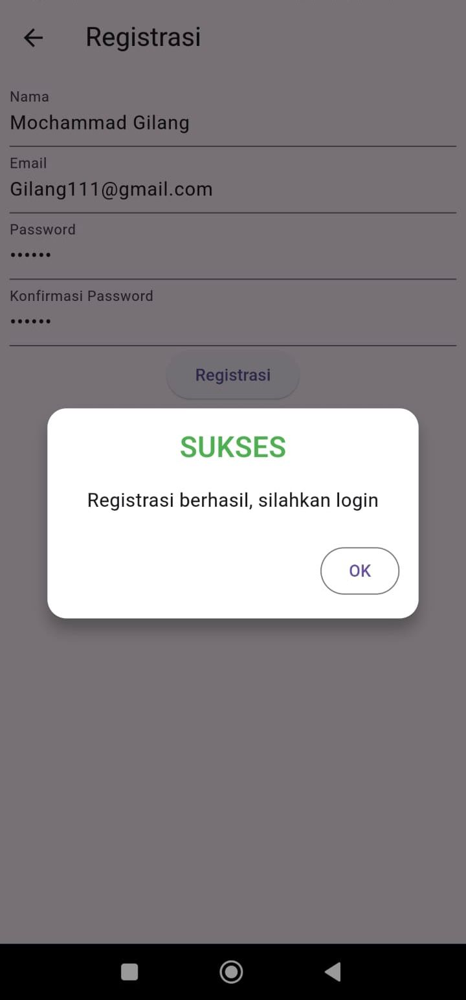
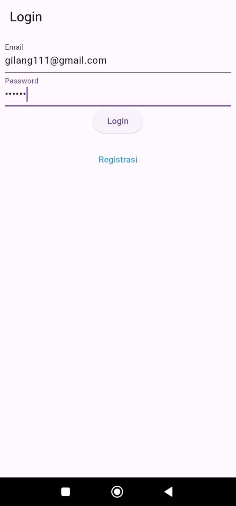
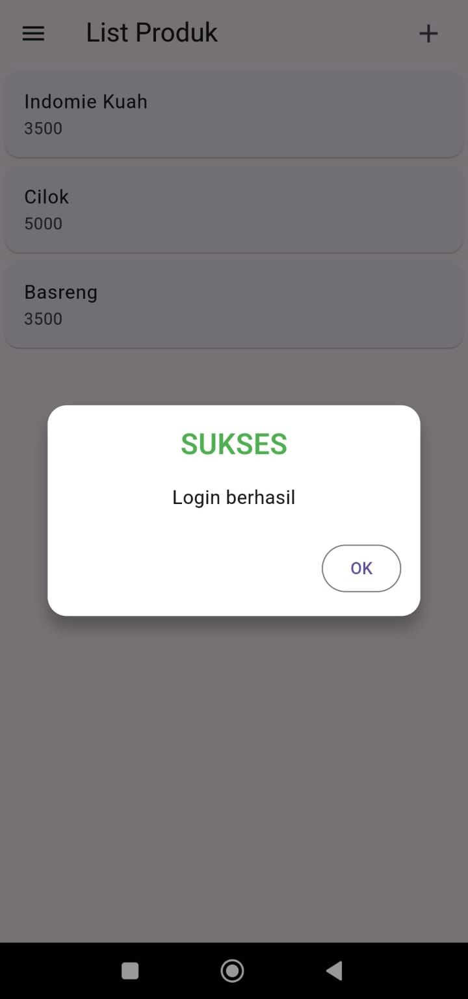
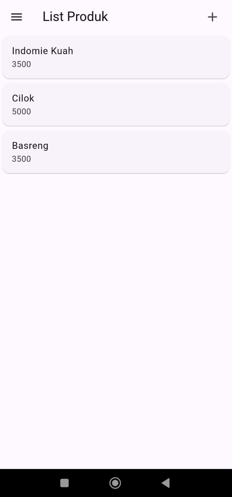
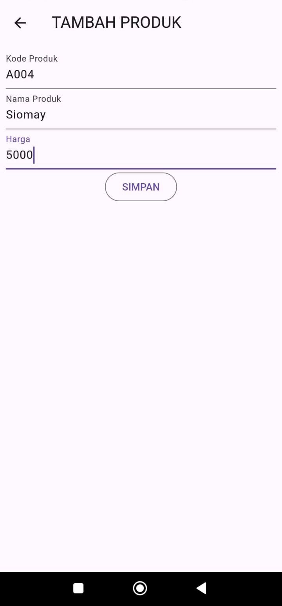
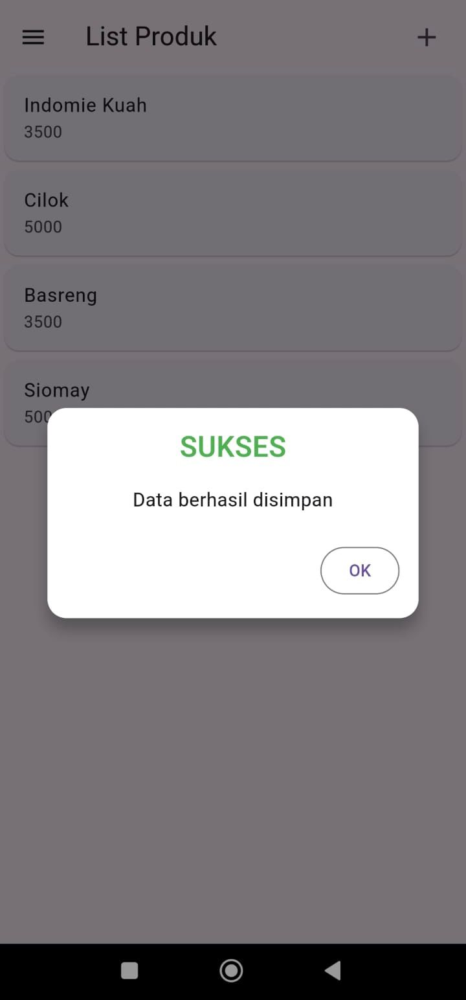
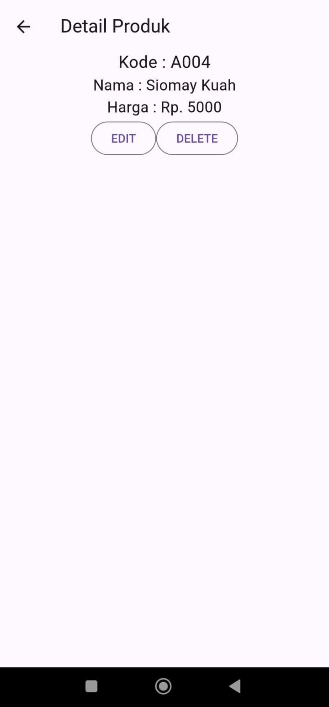
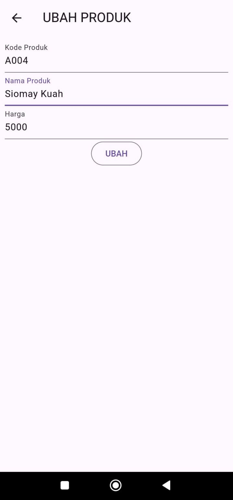
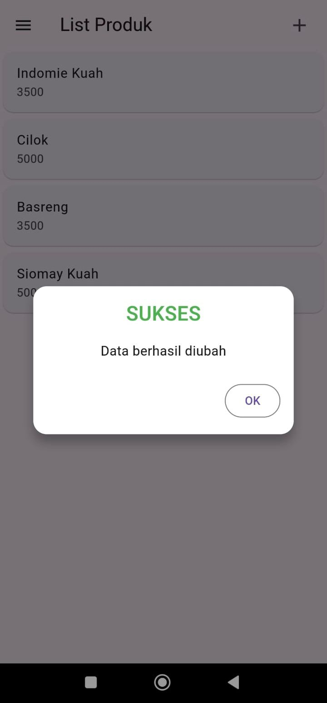
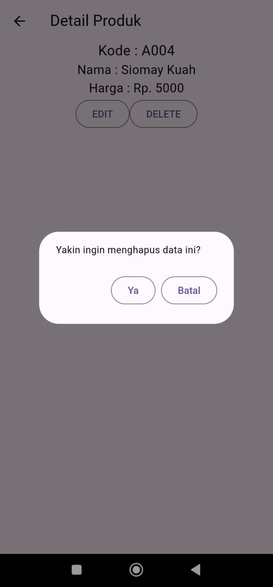

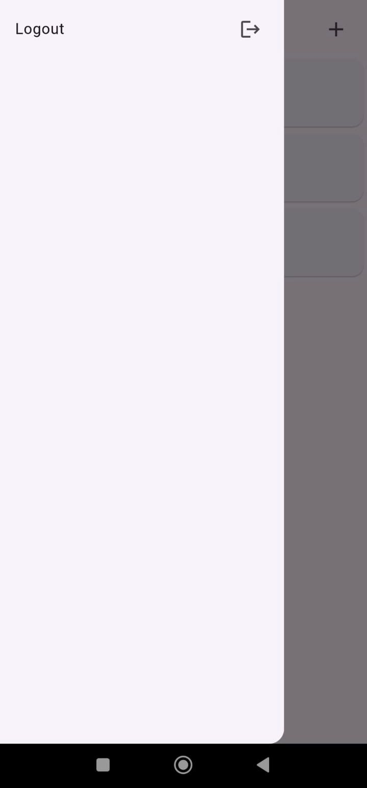
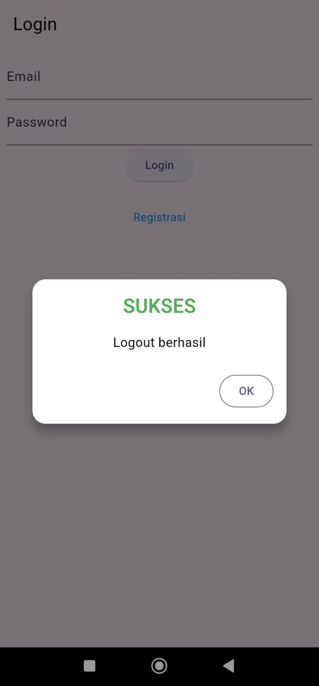
